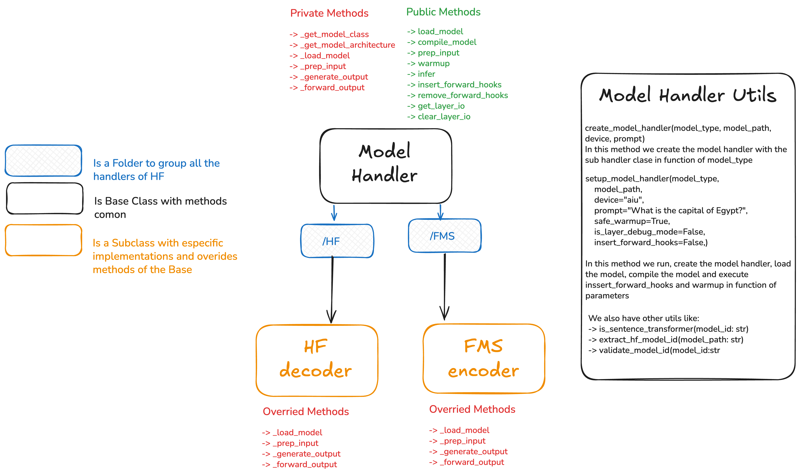

A unified and modular Model Handler architecture designed to abstract interactions with different model backends (Hugging Face and FMS). The design utilizes a base class strategy with specialized subclasses to ensure consistent interfaces across different model types.

🏗 Architecture Overview

The system is structured around a central Base Class that defines the contract, with implementations organized into library-specific modules.

1. Base Class: Model Handler
    - Acts as the parent class providing common functionality and defining the interface.

    - Public Methods: Exposes the standard API for external use, including load_model, compile_model, warmup, and infer.

    - Private/Abstract Methods: Defines internal methods (e.g., _load_model, _prep_input, _generate_output) that must be implemented by the subclasses.

2. Organization and Subclasses The implementations are grouped into specific folders. Each folder serves as a container for all handlers related to a specific backend library:
    - Folder /HF: Designed to group all Hugging Face handlers. Currently, it implements the HF decoder subclass.

    - Folder /FMS: Designed to group all Foundation Model Stack (FMS) handlers. Currently, it implements the FMS encoder subclass.

    - These specific subclasses override the base private methods to handle the unique loading, input preparation, and generation logic required by their respective libraries.

  
🛠 Model Handler Utils

A utility module is included to handle the instantiation and setup complexity:
    
- create_model_handler: Acts as a factory method. It initializes the correct subclass (e.g., HF decoder or FMS encoder) based on the provided model_type and path.

- setup_model_handler: A high-level function that orchestrates the complete setup process. It creates the handler, loads the model, compiles it, inserts forward hooks, and performs warmup based on the passed parameters.

- Helpers: Includes validation and identification tools like is_sentence_transformer and validate_model_id.

New model libraries can be added by creating a new folder. Additionally, new model architectures (e.g., an HF Encoder) can be easily added to existing folders.